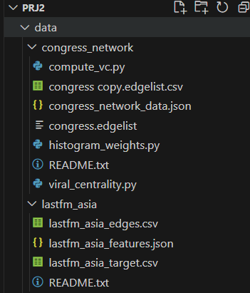

#### 数据集Twitter Interaction Network for the US Congress

数据集Twitter Interaction Network for the US Congress代表了第117届美国国会参议院和众议院的Twitter互动网络。基本数据通过Twitter的API收集，然后根据一名成员转发、引用、回复或提及另一名成员的twitter的次数比例来量化一个叫做“传输概率”的经验值。
数据的基本信息和文件结构如下：
  
数据本身是一个图结构，节点是Twitter的用户，边是他们发送消息的单向“传输概率”（边是有向的），共475节点+13289条边。数据集由两个主要文件构成。
congress_network_data.json包含了以下几类键值对。
inList：包含给某个用户发送连接的其他用户（可认为是入边）。
inWeight：与inList一一对应包含了上述每个用户之间的边的传输概率，可视为边的权重。
outList：包含从某个用户发出连接的其他用户（可认为是出边）。
outWeight：同上，包含了用户之间边的传输概率（边的权重）。
UsernameList：所有用户节点ID对应的用户名。
congress.edgelist文件包含了所有边的数据。

#### 数据集LastFM Asia Social Network

这个数据集是从LastFM用户社交网络通过公开API收集的图结构数据。数据的节点是来自亚洲国家的LastFM用户，边是他们之间的关注关系（有向边）。顶点特征是根据用户喜欢的艺术家提取的。该数据可用于一些位置预测、节点分类的任务。
数据共有7624个节点，27806条边。密度为0.0009，传递率0.1787。
数据集文件共有三个。
 
其中，lastfm_asia_edges.csv是边，共两列整数，代表边两端的节点。
Lastfm_asia_target.csv是目标节点，有7624个数据项，编号为0-7623。
而lastfm_asia_features.json是节点的特征值，有7624条、3e6余项数据。

#### 部署

把两个数据的文件夹全部放在/data下，如图：
